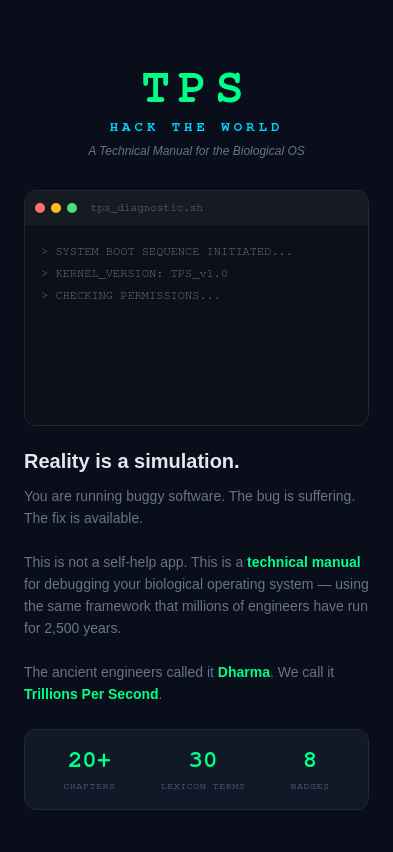
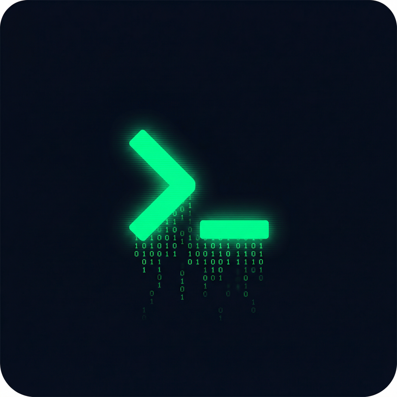

# TPS: Hack The World — Mobile App

**Tag:** `[ASSET]`  
**Contributor:** IDevSU-source  
**Date:** April 2026  
**Platform:** Android (React Native / Expo)

---

## What This Is

A native Android mobile app that transforms the full *Trillions Per Second* manual into an **interactive, gamified learning experience**. Built to increase people's knowledge of reality by making the TPS framework explorable, not just readable.

The app is a direct port of all content from this repository — every chapter, lexicon entry, devlog, and checkpoint — rendered through a terminal-aesthetic UI designed to match the cyberpunk tone of the source material.

---

## Features

| Feature | Description |
|---------|-------------|
| **20+ Chapters** | All content across 4 Parts (Introduction → Diagnostic → Code → Patch), with sequential unlock |
| **XP System** | Earn XP for completing chapters and devlogs; 8 named levels from "Booting Up" to "Root Access" |
| **8 Badges** | Awarded at each of the 6 Checkpoints, plus Lexicon Master and Signal Logged |
| **Checkpoint Screens** | Dedicated celebration screen at each of the 6 system checkpoints with insight summaries |
| **Searchable Lexicon** | All 30 TPS terms with legacy code, Pali term, definition, and category filter |
| **Dev Logs** | All 4 devlogs with immersive reader and auto-read XP reward |
| **Day Streak** | Tracks consecutive days of engagement |
| **Onboarding** | Animated terminal boot sequence on first launch |
| **Chapter Map** | Visual roadmap of all chapters with locked/unlocked states |
| **Profile/Stats** | Full progress dashboard with badges, level, and XP breakdown |

---

## Tech Stack

- **Framework:** React Native + Expo SDK 54
- **Language:** TypeScript
- **Styling:** NativeWind (Tailwind CSS for React Native)
- **Navigation:** Expo Router (file-based)
- **Storage:** AsyncStorage (local, no account required)
- **Animations:** React Native Reanimated + Animated API
- **Haptics:** expo-haptics

---

## Design Philosophy

The app follows the same aesthetic principles as the book:

> *"Monospaced fonts, Terminal aesthetics, High contrast."* — CONTRIBUTING.md

- **Color palette:** Matrix green (`#00FF88`) on deep navy black (`#0A0E1A`)
- **Typography:** Monospace throughout for the terminal feel
- **Part color coding:** Cyan (Introduction) → Green (Diagnostic) → Yellow (Code) → Orange (Patch)
- **No cloud, no account** — all progress stored locally on device

---

## Source Code

The full source code for the app is available at:

> [github.com/IDevSU-source/tps-app](https://github.com/IDevSU-source/tps-app) *(private — request access from contributor)*

Built with [Manus](https://manus.im) — an autonomous AI agent — as a Centaur operation: human direction, AI execution.

---

## Screenshots

### Onboarding — Terminal Boot Sequence

### App Icon

---

## License

This app is a derivative work of *Trillions Per Second* and is released under the same **CC-BY-SA 4.0** license. All content belongs to the open network.

> *"We hack the system to free the resources, not to capture them."*
